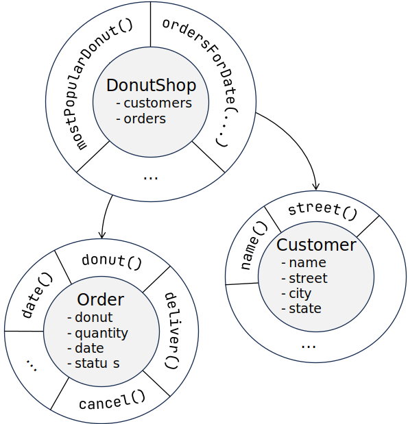

== Object Oriented vs. Data Oriented Donuts

[frame=none]
[grid=none]
[cols="1,1"]

|===
| 
| 
|===
[.text-left]
[source,java]
----
public List<Donut>
topThreeBestSellers(List<Order> orders) {
    return orders.stream()
        .collect(
            Collectors.groupingBy(
                Order::donut,
                Collectors.summingInt(Order::quantity))
            )
        .entrySet()
        .stream()
        .sorted(Map.Entry.<~>comparingByValue().reversed())
        .limit(3)
        .map(Map.Entry::getKey)
        .toList();
}
----